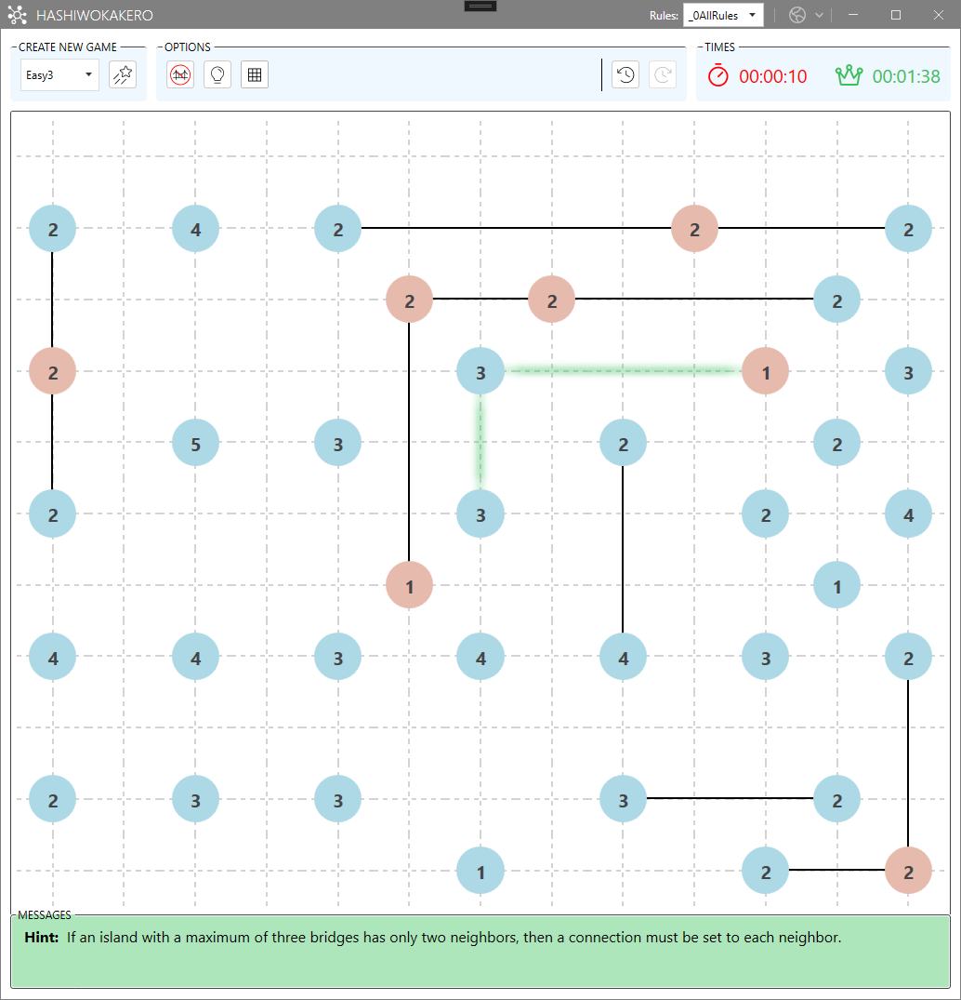

# Hashiwokakero WPF Project Wiki

Welcome to the comprehensive documentation for the Hashiwokakero WPF application project!

## 🌉 About Hashiwokakero

Hashiwokakero ("build bridges!" in Japanese) is a fascinating logic puzzle game played on a rectangular grid. The goal is to connect all numbered islands by drawing bridges between them, following specific rules that create an engaging and challenging puzzle experience.

### Game Rules
- **Islands**: Numbered cells (1-8) that must be connected
- **Bridges**: Connect islands orthogonally (no diagonal connections)
- **Connections**: At most two bridges can connect any pair of islands
- **Numbers**: Each island must have exactly as many bridges as its number
- **Network**: All bridges must form a single connected network
- **No Crossing**: Bridges cannot cross each other or pass through islands

## 🏗️ Project Overview

This is a modern WPF desktop application built with .NET 8.0 and C# 12, implementing clean architecture principles with comprehensive features for puzzle generation, solving, and user interaction.

### Key Features
- **Puzzle Generation**: Multiple difficulty levels with algorithmic generation
- **Interactive UI**: Modern WPF interface with MahApps.Metro styling
- **Hint System**: Intelligent rule-based hints using NRules engine
- **Solver Engine**: Google OR-Tools integration for optimal solutions
- **Multi-language**: Internationalization support
- **Comprehensive Testing**: Extensive unit test coverage

### Technology Stack
- **.NET 8.0** with C# 12 language features
- **WPF** for desktop UI with MahApps.Metro
- **MVVM Pattern** using CommunityToolkit.Mvvm
- **Dependency Injection** with Autofac
- **Business Rules** with NRules engine
- **Linear Optimization** with Google OR-Tools
- **Logging** with NLog
- **Testing** with NUnit, FluentAssertions, and Moq

## 📚 Documentation Structure

### Getting Started
- **[Getting Started](Getting-Started.md)** - Installation, building, and running the application
- **[User Guide](User-Guide.md)** - How to play and use the application

### Architecture & Development
- **[Architecture](Architecture.md)** - High-level system design and patterns
- **[Core Components](Core-Components.md)** - Detailed component documentation
- **[Development Guide](Development-Guide.md)** - Developer setup and guidelines
- **[Testing Strategy](Testing-Strategy.md)** - Test patterns and conventions

### Configuration & Reference
- **[Configuration](Configuration-Settings.md)** - Application settings and internationalization
- **[API Reference](API-Reference.md)** - Key interfaces and classes
- **[Troubleshooting](Troubleshooting.md)** - Common issues and solutions

## 🚀 Quick Start

1. **Prerequisites**: .NET 8.0 SDK, Visual Studio 2022 or later
2. **Clone**: `git clone https://github.com/Nowohier/CN_HashiWpf.git`
3. **Build**: `dotnet build` (or open in Visual Studio)
4. **Run**: Execute the WPF application

## 🤝 Contributing

We welcome contributions! Please see our [Development Guide](Development-Guide.md) for:
- Code standards and SOLID principles
- Git workflow and branching strategy
- Testing requirements and patterns
- Pull request process

## 📞 Support

- **Issues**: Report bugs or request features on GitHub
- **Documentation**: This wiki contains comprehensive guides
- **Code**: Well-documented interfaces and XML comments

---

*This documentation is maintained alongside the codebase. Last updated: 2024*